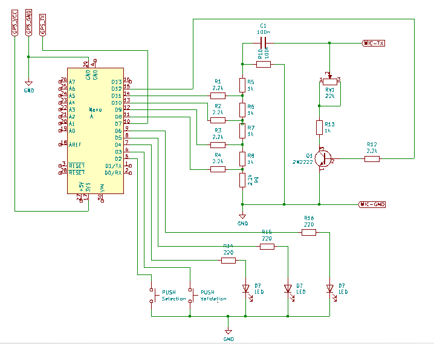
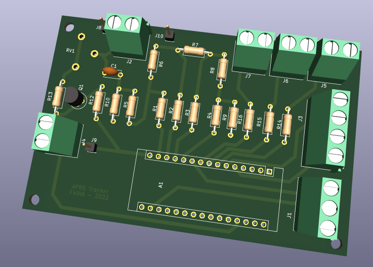

# GPS tracker on Ham radio APRS network

## The projet

This project is inspired by Valentin work with his APRS tracker using a DRA818 https://github.com/valentintintin/arduino-tracker-aprs-dra818. 

I initially wanted to a Baofeng UV5R as TX, finally I decided to use a Yaesu FT4X. Also I added the possibility to change after the startup which APRS symbol is used. 

### Hardware parts used
- Arduino [Nano](https://store.arduino.cc/arduino-nano)
- GPS Module ([NEO 6M](https://www.amazon.fr/NEO-6M-GPS-module-puissance-GY-GPS6MV2/dp/B01ICYA4QU))
- few electronics components (resistor, capacitor, 2N2222, variable resistor, LEDs and push button)

### Software parts used
- [PlatformIO](https://platformio.org/)
- [QAPRS lib](https://bitbucket.org/valentintintin/arduinoqaprs/) from Lukasz SQ5RWU, forked by Valentin to add PWM
- [TinyGPS+ lib](http://arduiniana.org/libraries/tinygpsplus/)
- [EasyButton](https://github.com/evert-arias/EasyButton) from Evert Arias 

### The circuit



The Kicad file is available in the _electronic_ folder

### The Arduino program

The project has one main function : **send its GPS coordinate on ham radio APRS network** using a FT4X as transmitter.

### Compile and run

1. Install [PlatformIO](https://docs.platformio.org/en/latest/installation.html)
2. Run `git clone https://github.com/f4iha/arduino-ft4x-aprs-tracker && cd ardu-aprs-tracker`
3. Run `mkdir lib; cd lib; git clone https://bitbucket.org/valentintintin/arduinoqaprs/; cd ..` to download the updated version of ArduinoQAPRS
4. You have to uncomment `APRS_HW_TYPE_R2R` and comment all the others in `.piolibdeps/ArduinoQAPRS/ArduinoQAPRS.h`
5. Update with your callsign in _main.cpp_ file and adjust if needed the used APRS symbol (see section **Change the APRS symbol** below for more details)
6. Plug your Arduino nano
7. Run `pio run --target upload -e nanoprod`

##### Notes

- The QAPRS lib uses a **R2R resistor network** to generate the sound signal

#### Program flow

1. At the startup, the Arduino will ask using 3 LEDs which APRS symbol will be used (car, bike, jogger)
    - If you want to start in test mode (no guard for GPS fix or TX rate), keep pressed the "validation" button at startup
2. Change and validate the symbol to be used
3. If the GPS is locked AND time between TX is reached ==> send the new location. The time between TX is defined by the speed and two affine functions.
4. Keep pressed the "validation" button to send your position (if GPS fix) manually

##### Change the APRS symbol

The APRS symbol are configured via the 2 variables aprsMarks and aprsTypes respectively linked. Selecting _velo_ (french for bike) will use the character _b_ for the symbol
```c
String aprsMarks[] = { "voiture", "velo", "pieton" };
char aprsTypes[] = ">b[";
```

This [aprs.net page](http://www.aprs.net/vm/DOS/SYMBOLS.HTM) is giving a good list of the main symbol.

### The PCB

I produce a PCB using through-hole components. This is available in the _pcb_  folder. There are also 3 pin (J8, J9 and J10) which can be used the PTT and the signal needs to remain separated.

